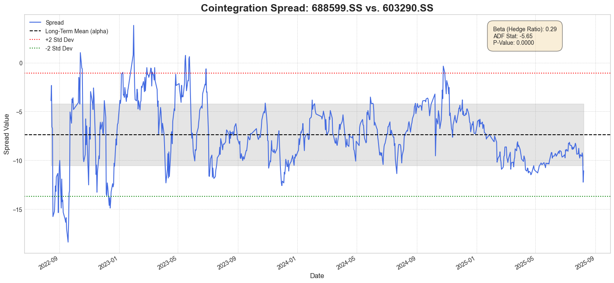
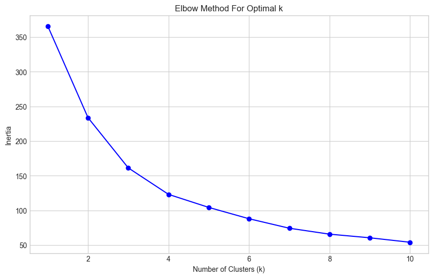
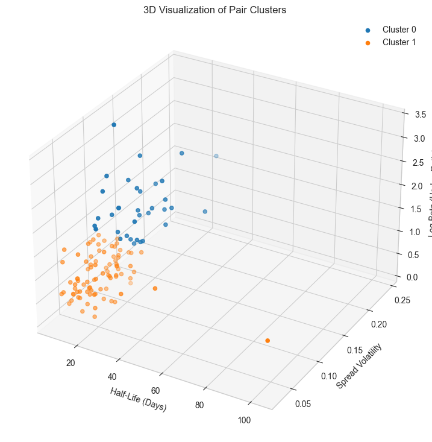
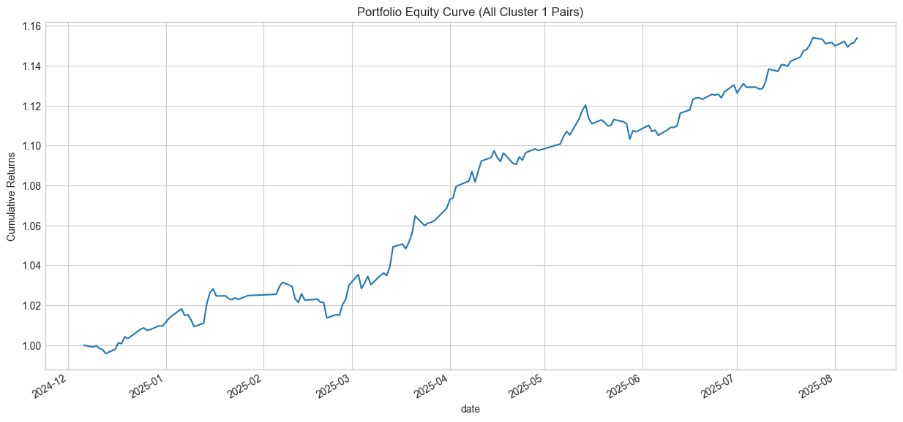
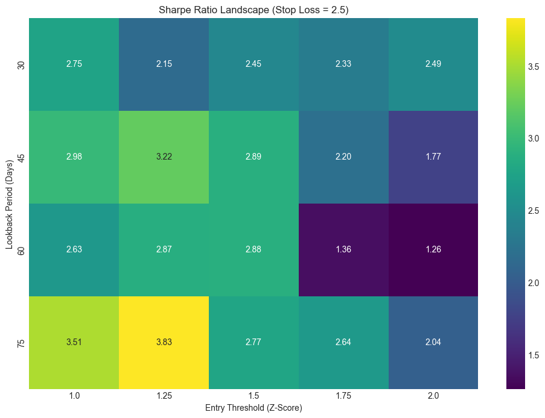

# Quantitative Pairs Trading: Project Documentation

## Table of Contents
1. [Data Pipeline Overview](#1-data-pipeline-overview)
2. [Quantitative Analysis Workflow](#2-quantitative-analysis-workflow)
    1. [Phase 1: Pair Discovery & Cointegration](#21-phase-1-pair-discovery--cointegration)
    2. [Phase 2: Feature Engineering](#22-phase-2-feature-engineering)
    3. [Phase 3: K-Means Clustering](#23-phase-3-k-means-clustering)
    4. [Phase 4: Strategy Development & Optimization](#24-phase-4-strategy-development--optimization)
    5. [Phase 5: Robustness & Validation](#25-phase-5-robustness--validation)
3. [Conclusion](#3-conclusion)

---

## 1. Data Pipeline Overview

The foundation of this project is a robust data pipeline designed to source, store, and serve financial data efficiently.

*   **Data Sourcing:** Historical daily stock prices are downloaded from the `yfinance` library, a reliable source for financial market data.
*   **Data Storage:** The downloaded data is stored in a local **MongoDB** database. Each document in the `daily_prices` collection represents a single day's price information for a specific ticker.
*   **Data Access (API):** Although not detailed or used in the notebook, a REST API (e.g., built with FastAPI or Flask) would typically sit on top of the MongoDB database. This allows the research environment (like this notebook) to query and retrieve data in a structured, efficient manner, decoupling the analysis from the raw data storage. However, in this case I dit not use the REST API for data retrieval, rather directly getting the data from MongoDB once.

```python
# Connecting to the database in the notebook
load_dotenv()

MONGO_URI = os.getenv("MONGO_URI")
if not MONGO_URI:
    raise ValueError("MONGO_URI environment variable is not set.")

client = MongoClient(MONGO_URI)
db = client["stocks_db"]
collection = db["daily_prices"]
```


---

## 2. Quantitative Analysis Workflow

This section details the end-to-end process of identifying, modeling, and backtesting the pairs trading strategy as implemented in the `cointegration_and_clustering.ipynb` notebook.

### 2.1 Phase 1: Pair Discovery & Cointegration

**Objective:** To identify pairs of stocks whose prices have a long-term, stable economic relationship.

#### Step 1: Correlation Filtering
As a preliminary step, perform a quick check for linear relationships. Then, calculate the **Pearson correlation matrix for all stocks over a 3-year period and filter for pairs with a correlation coefficient greater than 0.95**. This reduces the search space for the more computationally intensive cointegration tests.

#### Step 2: Cointegration Testing
Correlation is not sufficient to guarantee a stable relationship. Cointegration is a more rigorous statistical property that confirms a long-run equilibrium between two time series.

1.  **Linear Regression:** For each pair of stocks (A, B), model their relationship using an Ordinary Least Squares (OLS) regression:
    
    $$
    Price_B = \alpha + \beta \cdot Price_A + \epsilon
    $$
    
    Here, `β` is the **hedge ratio**, and `ε` is the residual, which represents the spread.
    
2.  **Spread Calculation:** The spread is the deviation from the long-term equilibrium:
    
    $$
    Spread_t = Price_{B,t} - (\alpha + \beta \cdot Price_{A,t})
    $$
    
3.  **Stationarity Test:** If the spread is stationary (i.e., it tends to revert to its mean), the pair is cointegrated. We test for stationarity using the **Augmented Dickey-Fuller (ADF) Test**. A low p-value (e.g., < 0.01) indicates that we can reject the null hypothesis of non-stationarity.

The following function encapsulates this logic:
```python
def do_regression(ticker1, ticker2):
    X = df[ticker1].values
    y = df[ticker2].values

    X = sm.add_constant(X)  # Add a constant term for the intercept
    model = sm.OLS(y, X).fit()
    alpha,beta = model.params

    residuals = y - (alpha + beta * X[:,1])

    if np.isnan(residuals).any():
        return np.nan

    adf_results = adfuller(residuals)

    return adf_results[0], adf_results[1], beta, alpha
```


### An example of spread and mean


<p align="center">
  
</p>


### 2.2 Phase 2: Feature Engineering

**Objective:** To quantify the dynamic characteristics of each cointegrated pair.

To prevent lookahead bias, you can split the 3-year dataset into a **2-year Formation Period** and a **1-year Trading Period**. Features are calculated *only* on the formation data.

```python
formation_period_days = 365*2
formation_end_date = df.index[0] + datetime.timedelta(days=formation_period_days)

formation_df = df[df.index <= formation_end_date]
```

For each pair, we calculate:
*   **Half-Life of Mean Reversion:** Measures how quickly the spread reverts to its mean. A shorter half-life is generally more desirable. It is calculated from the Ornstein-Uhlenbeck process formula:
    $$
    Half-Life = -\frac{\ln(2)}{\lambda}
    $$
*   **Spread Volatility:** The standard deviation of the spread. Lower volatility implies a more stable, predictable relationship.
*   **Log Beta:** The hedge ratio derived from the regression of log prices, which is often more robust.


### 2.3 Phase 3: K-Means Clustering

**Objective:** To group pairs with similar dynamic features, allowing us to treat them as a portfolio and avoid relying on a single "best" pair.

1.  **Elbow Method:** I used the Elbow Method to determine the optimal number of clusters (K) for our dataset, which was found to be K=2. This method plots the inertia (within-cluster sum of squares) for different values of K and identifies the "elbow" point where the rate of decrease sharply changes.
2.  **Clustering:** Then, apply K-Means clustering on the scaled features (Half-Life, Volatility, Beta) to segment the pairs into distinct groups.
3.  **Analysis & Visualization:** By analyzing the cluster centers and visualizing them in 3D, you can identify the cluster (cluster 1) with the most favorable trading characteristics (e.g., low half-life, low volatility). This becomes the "ideal cluster" for backtesting.


<p align="center">
  
</p>


<p align="center">
  
</p>


### 2.4 Phase 4: Strategy Development & Optimization

**Objective:** To define the trading rules and find the optimal parameters for executing the strategy.

#### Strategy Logic
The strategy is based on the Z-score of the spread, which measures how many standard deviations the current spread is from its rolling mean.

$$
Z-Score = \frac{Spread_t - \text{RollingMean}(Spread_t, \text{lookback})}{\text{RollingStdDev}(Spread_t, \text{lookback})}
$$

*   **Entry:** Enter a trade when the Z-score exceeds a predefined threshold (e.g., > 1.5 for short, < -1.5 for long).
*   **Exit:** Exit the trade when the Z-score reverts to its mean (crosses 0).
*   **Stop-Loss:** Exit the trade if the Z-score diverges beyond a wider threshold (e.g., +/- 3.0) to manage risk.

#### Parameter Optimization
Perform a **Grid Search** to find the optimal combination of parameters that maximizes the Sharpe Ratio on the out-of-sample trading data.

*   **`lookback`:** The window for the rolling Z-score calculation.
*   **`entry`:** The Z-score level to trigger a trade.
*   **`stop_loss`:** The Z-score level to cut losses.

```python
# The core backtesting function
def run_backtest(trading_df, pair_info, lookback, entry, stop_loss, exit_threshold=0.0):
    # ... (Z-score calculation) ...

    # --- Position Generation ---
    backtest_df['position'] = 0
    position = 0
    for i, row in backtest_df.iterrows():
        z = row['z_score']
        if position == 1 and (z >= -exit_threshold or z < -stop_loss):
            position = 0
        elif position == -1 and (z <= exit_threshold or z > stop_loss):
            position = 0
        elif position == 0:
            if z < -entry:
                position = 1
            elif z > entry:
                position = -1
        backtest_df.loc[i, 'position'] = position
        
    backtest_df['position'] = backtest_df['position'].shift(1).fillna(0)

    # ... (Performance calculation) ...
```

### 2.5 Phase 5: Robustness & Validation

**Objective:** To ensure the strategy is not overfit and is viable under real-world conditions.

1.  **Transaction Costs:** Introduce a conservative cost of **5 basis points (0.05%)** per trade to account for commissions and slippage.

2.  **Portfolio-Level Backtest:** To combat cherry-picking bias, I ran the backtest with the optimal parameters on **every pair** in the ideal cluster. Then average the daily returns to create a single portfolio equity curve. This provides a much more realistic expectation of performance.

3.  **Parameter Sensitivity Heatmap:** Visualize the grid search results as a heatmap. This shows how the Sharpe Ratio changes across different lookback periods and entry thresholds. A large, contiguous profitable region (green area) indicates a robust strategy that is not dependent on a single, fragile parameter set.

<p align="center">
  
</p>

<p align="center">
  
</p>

---


### 2.6 Limitations

*   **Static Cointegration:** The model assumes the `beta` and `alpha` from the formation period remain stable. In reality, these relationships can decay. A rolling regression or Kalman filter approach could create a more adaptive model.
*   **Transaction Cost Model:** I used a fixed basis point cost. A more granular model could account for variable spreads, market impact, and separate costs for shorting stocks.
*   **Execution Assumption:** The backtest assumes trades are executed at the daily closing price. In live trading, there would be intraday price movement and potential slippage.
    
## 3. Conclusion

*   Systematically identified a universe of cointegrated stock pairs from a large dataset.
*   Using K-Means clustering, grouped these pairs into portfolios based on their dynamic characteristics.
*   A mean-reversion strategy was developed and optimized using a grid search, yielding a clear set of optimal parameters.
*   Crucially, the strategy was validated through robustness checks, including the addition of transaction costs, a portfolio-level backtest to eliminate selection bias, and a parameter sensitivity analysis.
